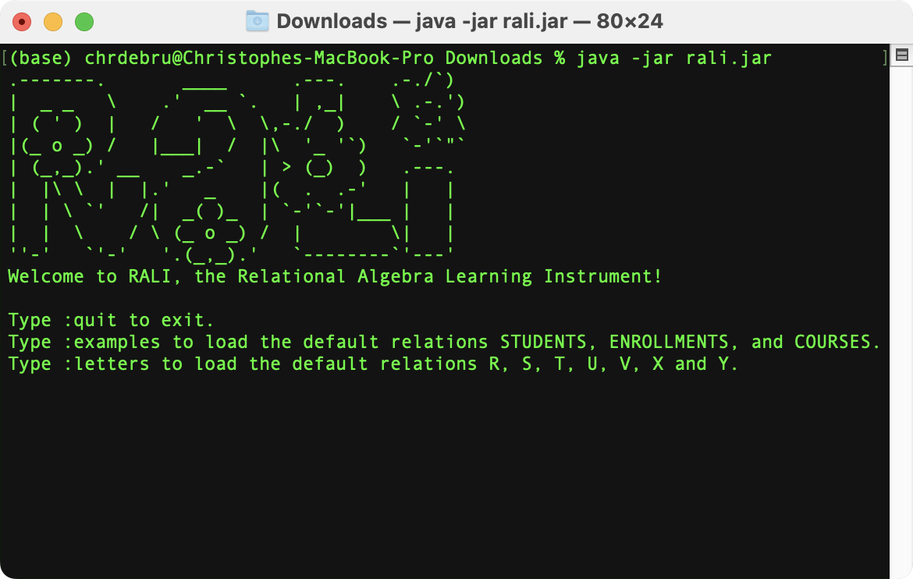
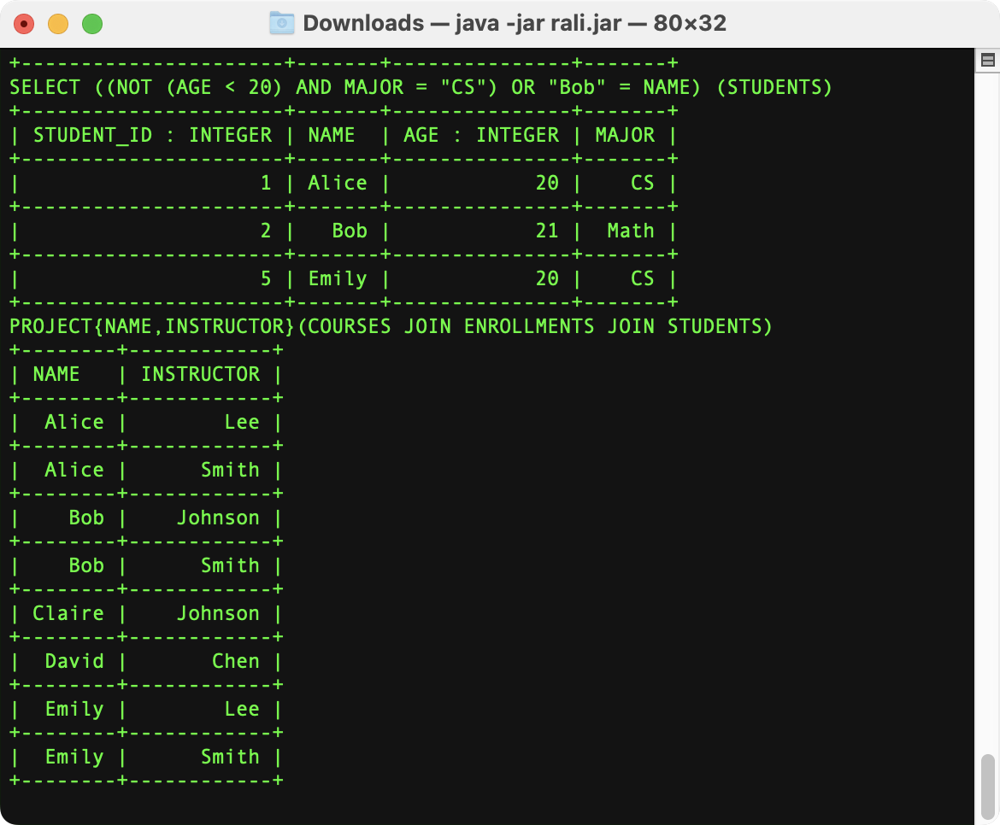

# (E)RALI: (Extended) Relational Algebra Learning Instrument
The Relational Algebra Learning Instrument (RALI) and Extended Relational Algebra Learning Instrument (ERALI) have been developed to aid students in learning (extended) relational algebra in my introductory course on databases [Bases de données](https://www.programmes.uliege.be/cocoon/cours/INFO0009-2.html).

 Many existing tools deviate from the relational model (e.g., the implicit qualification of attributes). With this tool, I provide students with a relational algebra implementation that follows the syntax and semantics seen in class. Another syntactical difference is that we use = to assign the result of a relational algebra expression to a relation instead of a right arrow. However, this implementation has a couple of important differences. First, the default datatype is assumed to be STRINGs. Attributes that are INTEGERs, DOUBLEs, or DATEs must be “typed” as such. Applying a function on attributes of different types may yield and error if coercion (i.e., implicitly converting between types) is impossible.

The implementation is, furthermore, a prototype. It has been (hastily) developed to aid you in your learning. As such, there may be bugs. If you encounter a bug, feel free to send an email to c.debruyne@uliege.be. While initially inconvenient, all operations, relations, and attributes must be written in UPPER CASE. This tool aims to help you formulate queries in relational algebra. At the exam, you will be asked to formulate queries by hand, using the formalism we have seen in the course. You must use the mathematical and Greek symbols at the exam.

To run RALI or ERALI, you must have the Java Runtime Environment (JRE) or the OpenJRE installed. Download (or compile) the JAR file(s). To launch the program, open a terminal in the directory where the JAR file is stored and run the following command `$ java -jar rali.jar` or `$ java -jar erali.jar`. Examples on how to use the two are found in the [documentation](./doc/documentation.pdf).

